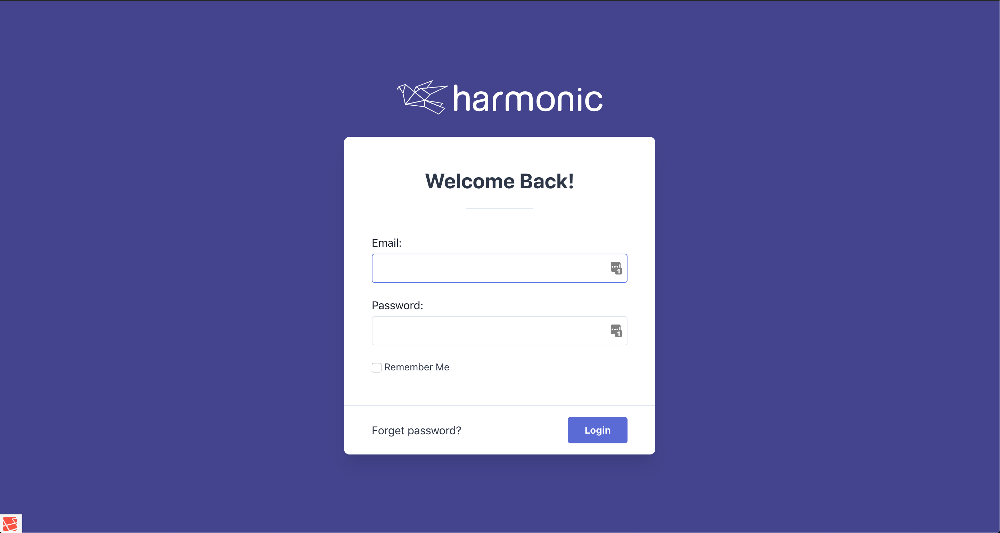
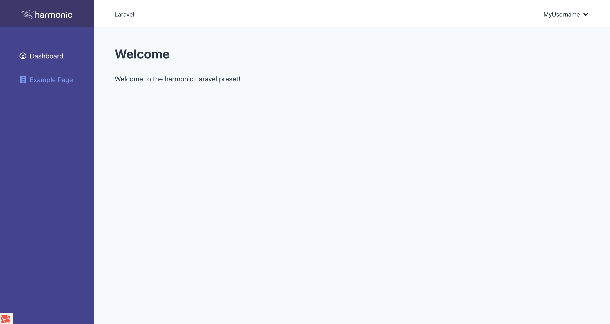

# Laravel Scaffold

This is the scaffold I use for new laravel projects. In a nut shell, it's a basic laravel app, with the following stack:

- Laravel (obviously) 7.x
- Inertia.js (and Vue)
- TailwindCSS

I'll try and keep it updated with major laravel version bumps :)

## Installing

```bash
$ composer create-project --prefer-dist atymic/laravel-scaffold app-name
```

## Packages

I've pre-installed a bunch of packages I end up installing on every project anyway. You can see a list of them in the
[composer.json](./composer.json) file.

## Front End Scaffolding

I'm using a fairly heavily modified version of [harmonic's inertia preset](https://github.com/Harmonic/laravel-preset).
At some point, I'll update this to make it more customised.


### Screenshots




## Licence
MIT :)

## Contributing

Feel free to send a PR, but this is my personal scaffold so if I disagree your PR won't get merged. Best to ask in an
issue first.
